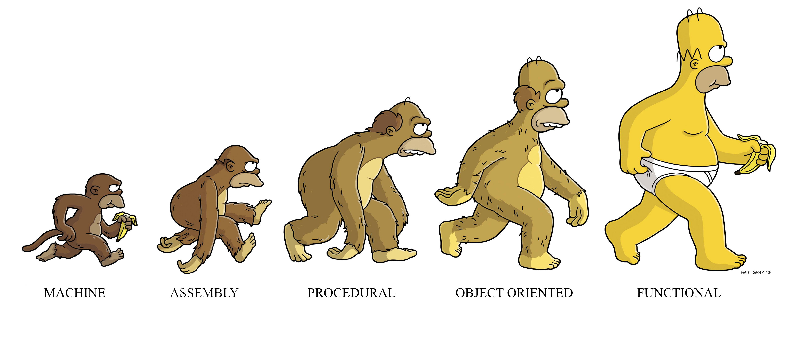
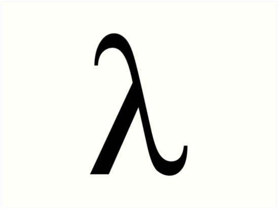
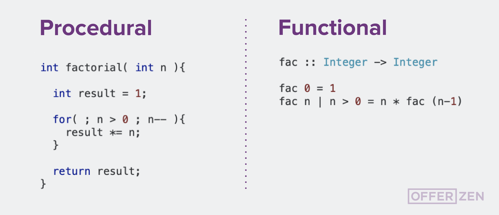

This article will be my take on why functional programming matters, largely with a focus on the paper with the same name, authored by John Hughes in the year 1984 - [Link to the paper](https://github.com/papers-we-love/papers-we-love/blob/master/languages-paradigms/functional_programming/why-functional-programming-matters.pdf).
<!--more-->

For me, I was blissfully unaware, for all intents and purposes, of the functional programming language paradigm until quite recently. But once I started learning about the powers that functional programming provides, I started feeling a responsibility of learning about it well!

As one of the most trivially available sources of information, one need to only look at page of Object-oriented Programming on Wikipedia to find [criticism for that paradigm](https://en.wikipedia.org/wiki/Object-oriented_programming#Criticism).

## Introduction

We are introduced to the simple definition of functional programming as a program which consists entirely of functions. Using functions to contain language primitives at the bottom level, other higher order functions are composed of the ones at a lower level, until reaching the main function which is defined using some combination of all the lower functions.

Some special characteristics and advantages of functional programming are
  - being devoid of assignment statements and thus, once a variable is given a value, it never changes.
  - functional programs do not contain side-effects. Side effect is anything apart from the computation required to arrive at the result.
  - Having no side effect also relieves the programmer of the burden of prescribing the flow of control.
  - Also, programs are _"referrentially transparent"_, that is, since expressions can be evaluated at any time, one can freely replace variables by their values and vice versa.

## Similarity and Differences

Compare all this to the advantages of structured programming. Structured programs contain no `goto` statements. Structured programming blocks don't have multiple entry and exits. Moreover, structured programs are more manageable mathematically than unstructured ones.

But the real power of structured programs comes from modular design. Small modules have limited function, hence they can be coded in less time and also easily. Also, general purpose modules can be re-used as parts of a subsequent larger program or module. Modules of a program can be tested independently which helps reduce the time in debugging.

Don't these advantages seem familiar? Well, the spirit of the advantages that structural programs have is in tune with the advantages of functional programming too, having a modular approach and having pure functions(not having multiple entry and exits). The paper shows two very important ways functional programming allows for conceptually modular flow - higher-order functions and lazy evaluation. Breaking down the program conceptually and then glueing pieces back together.

## Higher-order functions
Functional programming allows functions which are indivisible in conventional languages to be expressed as combination of parts - a general higher order functions and some specialising ones. Once defined, higher order functions allow many operations to be programmed easily.

Whenever a new datatype is defined, higher order functions should be written. This makes manipulation of datatypes easy as it localises the knowledge of the implementation of the datatype. It can be thought of as extending a language with new control structure whenever required.

## Lazy evaluations
To understand lazy evaluations, we need to remember that functions can be composed of other functions. If `g` is a function that operates on the outputs of function `f`, then we can modularize `f` as a generator to construct a large number of possible answers and `g` will only select or consume the ones it deems necessary. `f` can even be a non-terminating function, producing an infinite amount of output, but this works out as `f` will be terminated as soon as `g` is finished. This allows termination conditions to be separate from the loop bodies.

Imagine generating all possible moves ahead for a game, like chess. The generation would greatly benefit from lazy evaluation as it would only generate moves till the appropriate move is achieved.

## Conclusion
The paper concludes by that modular programs need to mean more than just modules. One can only break down the program as much as the language provides the ability to glue back the pieces together. Smaller and more general modules can be reused more widely. This is the reason why functional programs are so much smaller and easier to write than conventional ones. In the end, the programmer should expect to use higher-order functions and lazy evaluation as their tools for achieving modularity.
